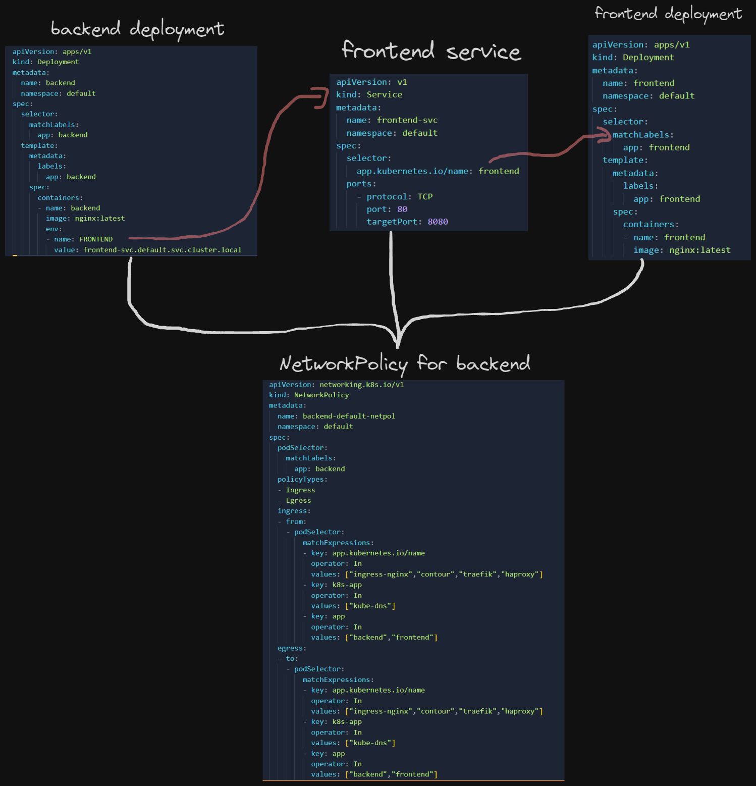

<h1 align="center">K8s-netpol-ctrl</h1>
<p align="center">

</p>

<h2 align="center">An opinionated Kubernetes NetworkPolicy controller implemented in Go.</h2>

[](https://github.com/adykaaa/k8s-netpol-ctrl/actions/workflows/tests.yaml)
[](https://goreportcard.com/report/github.com/adykaaa/k8s-netpol-ctrl)
[](https://coveralls.io/github/adykaaa/k8s-netpol-ctrl?branch=main)
# NetworkPolicies
Network policies are crucial in Kubernetes due to their role in securing network traffic and isolating applications within shared environments. They adhere to the principle of least privilege, allowing pods to communicate only with necessary counterparts. By providing a defense in depth, they limit potential damage from security breaches and hinder lateral movements within the network. Additionally, they support compliance with security standards, contributing to an overall robust security posture.

# Prerequisites
- For the controller to work, it needs to run in a K8s cluster, and it needs to have certain Roles. You can find them in the *deploy.yaml* file
- The K8s cluster needs to have a CNI which supports NetworkPolicies, precisely NetworkPolicies with MatchExpressions (e.g Weave, Calico) 

# Get Started with K8s-netpol-ctrl 🚀

## Run it inside your K8s cluster (recommended)
```bash
git clone https://github.com/adykaaa/k8s-netpol-ctrl.git
cd k8s-netpol-ctrl
kubectl apply -f deploy.yaml
```

## Run it locally
```bash
git clone https://github.com/adykaaa/k8s-netpol-ctrl.git
cd k8s-netpol-ctrl
go run main.go
```

## Run it in a container on your machine (needs a valid kubeconfig inside the container) 
```bash
git clone https://github.com/adykaaa/k8s-netpol-ctrl.git
cd k8s-netpol-ctrl
docker build . -t k8s-netpol-ctrl
docker run k8s-netpol-ctrl
```

# But what does it actually do❓

The controller uses the K8s informer API to watch for events related to Pods, Deployments, StatefulSets, and DaemonSets (objects of interest) - and based on these events, handles the NetworkPolicy creation / update / deletion. A NetworkPolicy controls how Pods can communicate with each other, or with namespaces. This controller only allows communication to other Pods - specifically Pods with the same labels, Pods that are part of an Ingress Controller, or Pods that are part of CoreDNS. This reduces the surface area of attack for intruders without limiting the communication too much for the deployed services.

 **Add**: When an object of interest is added to the cluster, the controller automatically creates a NetworkPolicy for it.

 **Update**: When an object of interest is updated, the controller updates the existing NetworkPolicy for the object (if it doesn't exist yet, we create one). The update events we are looking for are: label changes, and valid cluster local environment variable changes.

 **Delete**: When an object of interest is deleted, the controller automatically deletes the NetworkPolicy it created for it.

## 🔶 Cluster local environment variables
 When we are dealing with services, a [good practice](https://12factor.net/config) is to use an environment variable as a connection string to another service. E.g if we deploy a Deployment called *backend* to the *default* namespace, it can connect to the *frontend* by specifying the frontend's connection string like so: *frontend.default.svc.cluster.local*. This enables the backend to go through K8s internal networks and target the Service that is in-front of *frontend* that acts as an internal load balancer to the *frontend* Pods.

 **The controller automatically detects whether an object of interest has a valid (*meaning pointing to an object that actually exists inside the cluster and is reachable*) cluster local environment variable**, and automatically appends the needed Pod labels to the object's NetworkPolicy.
 E.g if a *backend* Pod has *frontend.default.svc.cluster.local*" as an environment variable, the controller collects all the Pod labels that are being selected by the Service, and appends them to the NetworkPolicy of *backend*. In the end, the controller would create a NetworkPolicy which only allows communication to the frontend Pods, ingress Pods, and CoreDNS pod.

<p align="center">
  
</p>

## 🕸️ When an object does not have a valid cluster local environment variable
When the deployed object of interest does not have a valid / any cluster.local env. var, the case is pretty simple. We only want its Pods to communicate with each other, CoreDNS Pods and the supported Ingress controller Pods. This list can (and probably wil) be extended in the future.

### TODOs

- [ ] mooaaaaarr unit tests
- [ ] more comments
- [ ] support more K8s object types (e.g CRDs?)
- [ ] come up with a way to safely support Namespace based policies
- [ ] integrate logging, separate log levels with Zerolog

## Contributions


This software will always stay open-source. I am only dealing with this in the little free time I have, so every contribution is welcome. Feel free to fork the repository, and open a PR. If you have any questions, concerns, you can find me on LinkedIn (it's in my GH profile).
